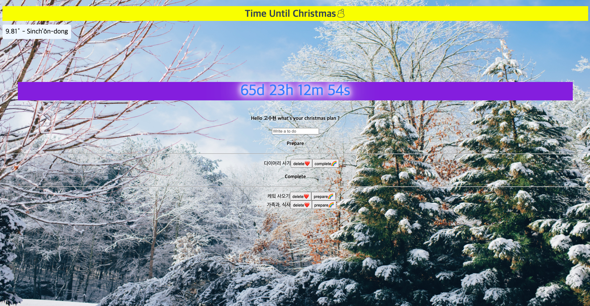

# Vanilla JS

크리스마스 계획을 세우는 페이지입니다.

## [배포 링크](https://gosuego.github.io/Vanilla-JS/)

## 사용기술

HTML, CSS, JavaScript

## 세부 내용

- 바닐라 자바스크립트는 브라우저를 통해 제공되는 자바스크립트
- Console
- Function
- Variable 변수 constants let
- Class Object Arrays
- DOM(Document Object model)
- 자바스크립트로 HTML을 바꿀 수 있다. (자주 쓰이지 않음)
- API는 다른 서버로부터 데이터를 손쉽게 가져올 수 있는 수단이다.

## 데이터 타입

- Variable 변수생성/초기화/사용
- Array []
- Object {} consle.log is a object
